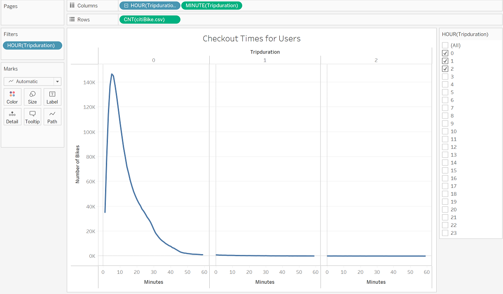
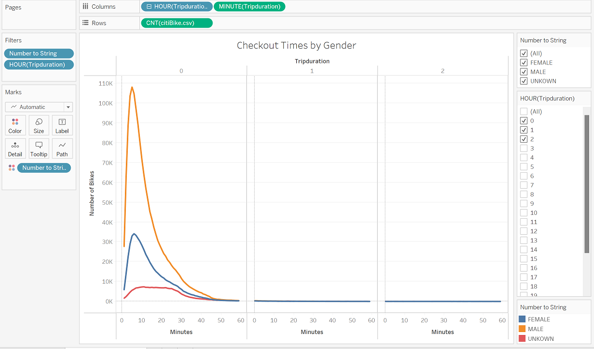
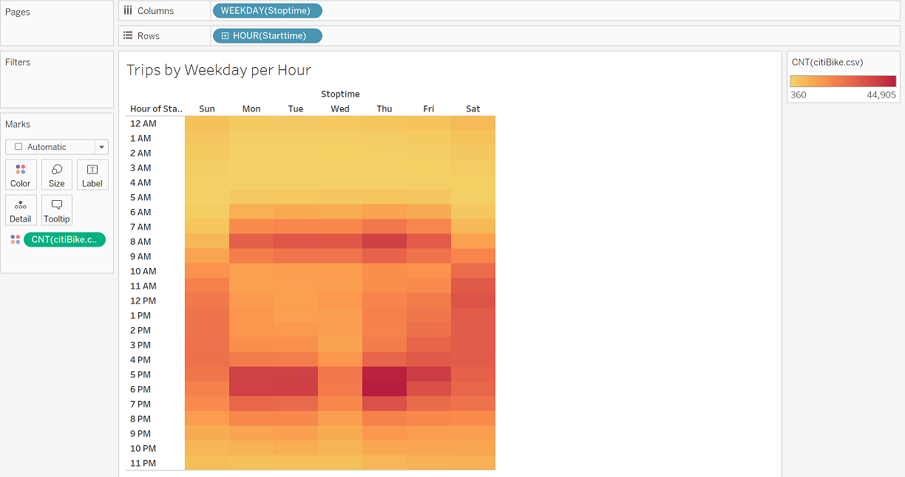
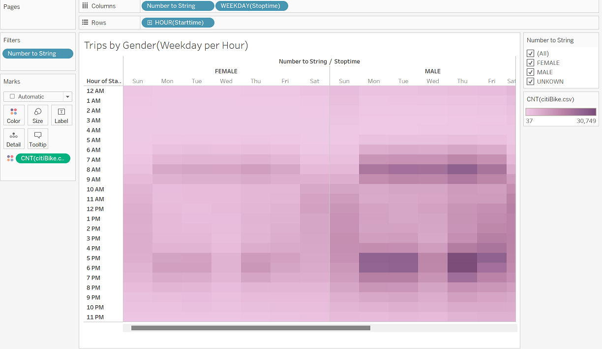
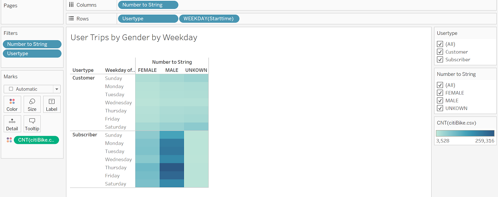
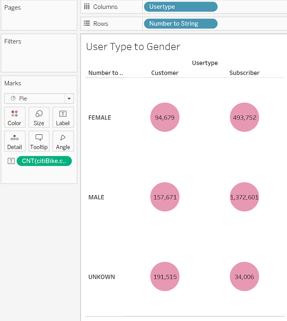
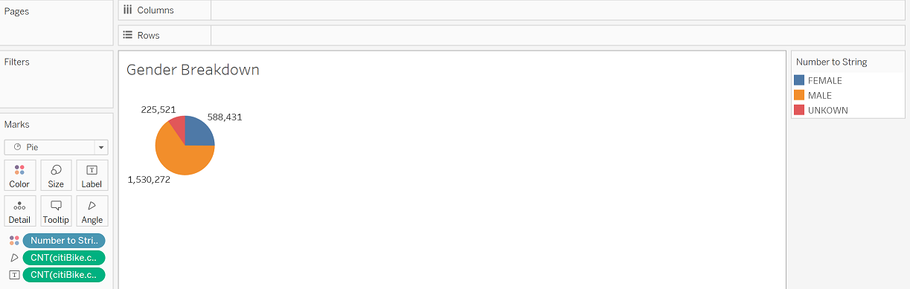

# Bike_Sharing

## Overview

Data analization to determine feasibility of bicycle sharing app, CitiBike, in Des Moines, IA (using Tableau)

## Website

### Checkout my Tableau Story!

[Enjoy the Ride!](https://public.tableau.com/app/profile/sarah.michelle4772/viz/NYCCitiBikeAnalysis_16674286319930/NYCCitibikeAnalysis?publish=yes)

## Purpose

An investor is interested in deploying a bicycle sharing app in Des Moines, Iowa. The analysis gathers Citibike data from New York City, and uses Tableau to determine trends that may be helpful for Des Moines investors.

## Results

### Bike Checkout Times for Users

- Trip duration peaks around five to ten minutes.

### Bike Checkout Times by Gender

- Male riders outweight female riders.

### Trips by Weekday per Hour

- 6am - 9am are peak weekday ride times.

### Trips by Gender (Weekday per Hour)

- 10am - 6pm are peak weekend ride times.

### User Trips by Gender by Weekday

- Males who have a subscription, do more riding. Also the busiest day is Thursday amongst Males.

## Summary

- Males tend to use the CitiBikes more, especially those with a subscription.
- On the weekdays, early morning hours, are the most popular times for riding.
- Incentivizing subscriptions is a good marketing task.
- Trying to publicize more women riding, could generate a more diverse outcome.
- Tourist areas seem to draw more attraction to biking.

### Breakdown of User Types by Gender

### Overall Numbers of Riders by Gender

